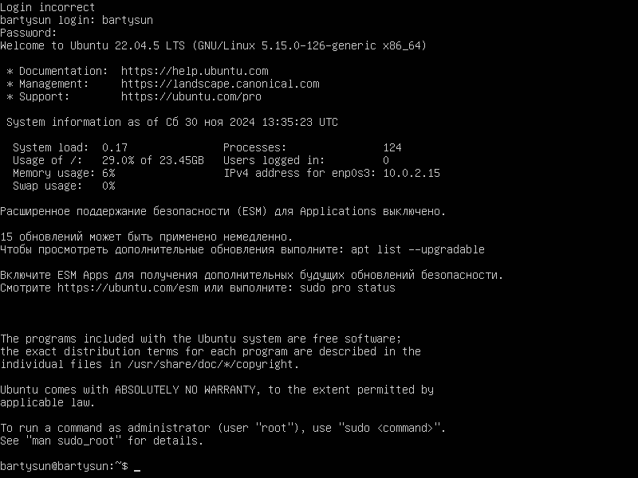
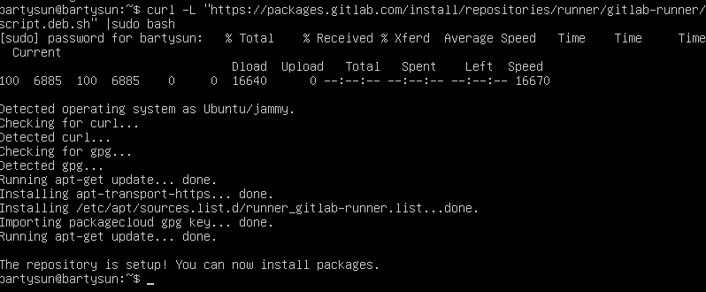
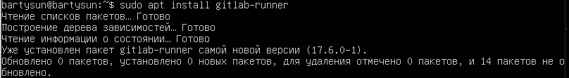
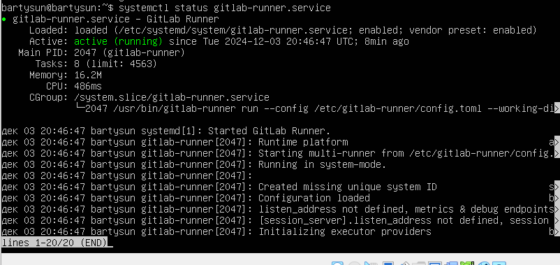
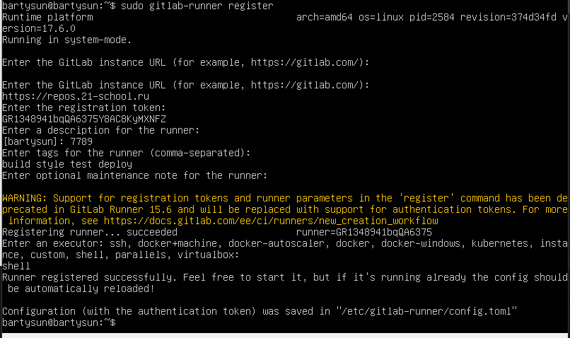
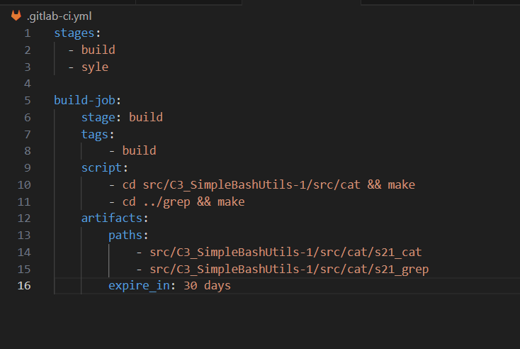

## Part 1. Настройка gitlab-runner
- Подними виртуальную машину *Ubuntu Server 22.04 LTS*.

- Скачай и установи на виртуальную машину gitlab-runner.

- Запустить службу: sudo gitlab-runner start

- Статус сервиса:

- Запусти gitlab-runner и зарегистрируй его для использования в текущем проекте (*DO6_CICD*). Для регистрации понадобятся URL и токен, которые можно получить на страничке задания на платформе.
- Регистрация токена:
sudo gitlab-runner register

## Part 2. Сборка

- Задание: Напиши этап для CI по сборке приложений из проекта *C2_SimpleBashUtils*.В файле _gitlab-ci.yml_ добавь этап запуска сборки через мейк файл из проекта _C2_. Файлы, полученные после сборки (артефакты), сохрани в произвольную директорию со сроком хранения 30 дней.

### Part 3. Тест кодстайла

`-` Поздравляю, ты выполнил абсолютно бессмысленную задачу. Шучу. Она была нужна для перехода ко всем последующим.

**== Задание ==**

#### Напиши этап для **CI**, который запускает скрипт кодстайла (*clang-format*).

##### Если кодстайл не прошел, то «зафейли» пайплайн.

##### В пайплайне отобрази вывод утилиты *clang-format*.

### Part 4. Интеграционные тесты

`-` Отлично, тест на кодстайл написан. [ТИШЕ] Говорю с тобой тет-а-тет. Не говори ничего коллегам. Между нами: ты справляешься очень хорошо. [ГРОМЧЕ] Переходим к написанию интеграционных тестов.

**== Задание ==**

#### Напиши этап для **CI**, который запускает твои интеграционные тесты из того же проекта.

##### Запусти этот этап автоматически только при условии, если сборка и тест кодстайла прошли успешно.

##### Если тесты не прошли, то «зафейли» пайплайн.

##### В пайплайне отобрази вывод, что интеграционные тесты успешно прошли / провалились.

### Part 5. Этап деплоя

`-` Для завершения этого задания ты должен перенести исполняемые файлы на другую виртуальную машину, которая будет играть роль продакшна. Удачи.

**== Задание ==**

##### Подними вторую виртуальную машину *Ubuntu Server 22.04 LTS*.

#### Напиши этап для **CD**, который «разворачивает» проект на другой виртуальной машине.

##### Запусти этот этап вручную при условии, что все предыдущие этапы прошли успешно.

##### Напиши bash-скрипт, который при помощи **ssh** и **scp** копирует файлы, полученные после сборки (артефакты), в директорию */usr/local/bin* второй виртуальной машины.
*Тут тебе могут помочь знания, полученные в проекте DO2_LinuxNetwork.*

- Будь готов объяснить по скрипту, как происходит перенос.

##### В файле _gitlab-ci.yml_ добавь этап запуска написанного скрипта.

##### В случае ошибки «зафейли» пайплайн.

В результате ты должен получить готовые к работе приложения из проекта *C2_SimpleBashUtils* (s21_cat и s21_grep) на второй виртуальной машине.

##### Сохрани дампы образов виртуальных машин.
**P.S. Ни в коем случае не сохраняй дампы в гит!**
- Не забудь запустить пайплайн с последним коммитом в репозитории.

### Part 6. Дополнительно. Уведомления

`-` Здесь написано, что твое следующее задание выполняется специально для нобелевских лауреатов. Здесь не сказано, за что они получили премию, но точно не за умение работать с **gitlab-runner**.

**== Задание ==**

##### Настрой уведомления об успешном/неуспешном выполнении пайплайна через бота с именем «[твой nickname] DO6 CI/CD» в *Telegram*.

- Текст уведомления должен содержать информацию об успешности прохождения как этапа **CI**, так и этапа **CD**.
- В остальном текст уведомления может быть произвольным.

## Chapter IV

`-` Хорошо. По завершении серии заданий сотруднику следует пройти в комнату отдыха.

Пока у тебя выдалась свободная минутка в комнате отдыха, ты, попутно размышляя о странности происходящего, решаешь проверить почту.

Не успел ты достать телефон, как в комнату отдыха зашёл ещё один человек.

`-` Привет, что-то я тебя тут раньше не видел.

`-` Было бы странно, если бы видел. Я тут первый день, хах.

`-` О, первый день! Ну и как тебе наш «босс»? — последние слова прозвучали с явной иронией.

`-` Это был босс? Фух, всё-таки он не одному мне кажется странным... и слегка грубым? Я уж думал, что вы все в Англии такие.

`-` Ахах, ни в коем случае, друг. Это просто розыгрыш для новичков, но не волнуйся, завтра всё будет в порядке. Кстати говоря, вон идет и настоящий босс, кажется, как раз к тебе. Ну, удачи, свидимся еще.

Незнакомец быстро пропал и в комнату зашел невысокий мужчина в дорогом костюме, с небольшой залысиной, навскидку лет этак 50-60 лет. Не дожидаясь твоих слов, он с тонкой, едва уловимой улыбкой произнес:

`-` Ах, вы, видимо, Томас. Поистине великолепное выполнение тестовой работы. Надеюсь, вы не испугались нашей милой подруги ASI младшей, она высоко отозвалась о вас. Итак, позвольте мне подробнее рассказать, чем мы тут вообще занимаемся и какова ваша роль в нашей компании...

